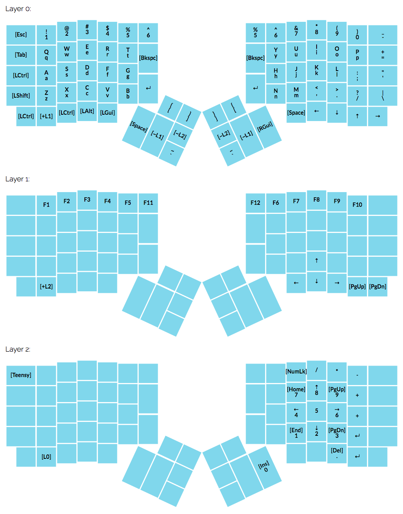

# My [ErgoDox EZ](https://ergodox-ez.com/) keymap

**Geared for MacOS programmers and Wacom users.**

## Download

Use [Teensy Loader](https://www.pjrc.com/teensy/loader.html) to load my keymap layout:

* [`ergodox_firmware.hex`](ergodox_firmware.hex)

## Keymap

## Tip

In order to get used to the new layout, I highly recommend printing out your keymap and putting it right in front of your keyboard:

## Links

* [ErgoDox Layout Configurator](https://keyboard-configurator.massdrop.com/ext/ergodox)
